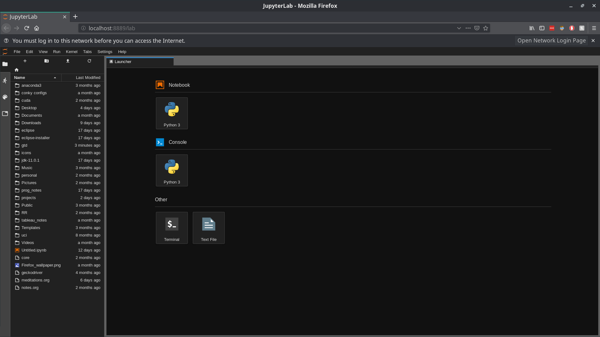

## Data Exploration and Cleaning in Jupyter Notebooks

Jupyter notebooks were originally conceived of as a portable means of combining code and written research, I find them to be an excellent environment for exploring data and toying around with different data engineering operations. Jupyter notebooks are made up of text blocks in either code or markdown. Markdown is quick and efficient way of writing text and formatting all in one go. I already showed you how to write comments in code, 
but with markdown you can write detailed explanations of what your code blocks are doing or give commentary on what's being outputted by adjacent code cells. 

Jupyter also nicely outputs tables and graphs that your code produces and allows you to run your code in a step by step manner. Mean that you could load a datasource in one cell and then write any number of cells that perform different operations on it allowing you to then evaluate which direction your eventual analysis or program will go. I also like to use the markdown cells to write nicely formatted notes about what each cell does or store links to online resources that are relevant to what ever I'm doing with a certain project.

In this next part we'll go over the basics of running jupyter notebooks by doing some basic data processing. 

* Firing up Jupyter Lab
* writing and running markdown and code cells
* performing operations on columns and rows of data
* Filling missing values
* splitting up our dataframes along certain conditions 
* converting to markdown or html see: https://www.blog.pythonlibrary.org/2018/10/09/how-to-export-jupyter-notebooks-into-other-formats/ 

## Starting up Jupyter lab

If you've already installed Anaconda you already have Jupyter notebooks the base component that we'll be working with. The whole Jupyter project is moving towards it's more recent incarnation **Jupyter Lab**
There are a lot of tutorials out there focusing on Jupyter notebooks, and if I was starting out I might be tempted to just work with Jupyter notebooks and be intimidated by Jupyter Lab. But really Jupyter lab is just better at this point and the commands and functionality I'm going to be explaining to you is basically the same across both platforms. Jupyter lab just adds very ncie quality of life features like a file menu, command tab, ability to launch a terminal, and access a text editor all in the same platform. Making it a pretty powerful and accessible Interactive Development Environment (IDE) for beginners. 

To start Jupyter Lab, open up a terminal like last time and enter the command: 

```bash
jupyter lab

```
Your web browser should pop up and if this is the first time jupyter is running you'll be asked to add in an authentication key. Back in your terminal you should see a bit of text saying ```Authentication key=``` and a bunch of random text. That's your key, now copy and paste that into the window that just popped up in your browser using the mouse not a keyboard shortcut like ctrl+C[^1].  

Once that's done you should see a window like the one bellow:


From here launch a python notebook, which you can do by clicking on the Python 3 emblem right bellow the orange symbol that is conveniently labeled 'notebooks[^2]'. 

This should bring you to an image like the one bellow: 


The first text area in the notebook is by default a code block and I would suggest trying to write some code in there right now just to get a feel for what jupyter and it's underlying iPython notebook is all about. 
Each text area or cell in jupyter's nomenclature is kind of like a minature script yet the variables, functions, and objects are shared between the different cells.

Adding cells, changing a cell from Code to markdown, running cells, can all be done from the application's interface but I'll share with you two shortcuts that I think are important

```SHIFT + ENTER``` will execute a cell and create a new one bellow it 
```ESC + M``` will turn a code cell to a markdown cell while replacing the M with a C will turn it back to a code cell 

Feel free to explore the interface and get comfortable with it. And don't be afraid of breaking anything, right now there really isn't too much to break. Besides in your programming career a rather large chunk of your time will 
be mostly consumed by fixing things that are broken. It's both good for your intuition and sanity to get used to it now. 

Once you're comfortable open up another terminal[^3] and go clone this [git repository](Put repository link here) using git if you haven't yet. 

The left hand panel of the jupyter interface should reflect the directory that you ran your jupyter server in and you should see the folder you just downloaded: Quant_yourself somewhere around there. If you don't just move the folder to where ever your jupyter server is running from and you should see it then  Look at what folders or files you see in your jupyter notebook or run the jupyter server from where you put the Quant_yourself folder. Recall that in the bash terminal you can see the path to where you currently are to the left of your cursor. 

Once you have DataCleaning.ipynb loaded we'll continue from there. 

[^1]:Quick learning moment: in the bash terminal ctrl+c is actually how you kill a bash command. When you want to shut down the jupyter server in your terminal press ctrl+c and the process will stop 

[^2]: Jupyter lab is a pretty nice IDE right out of the box as the launcher suggests you can also edit text files aka python scripts or really code scripts, as well as launch a terminal or python console.  

[^3]: Don't try to type anything into the terminal running your jupyter lab server, it'll break it most likely.  
